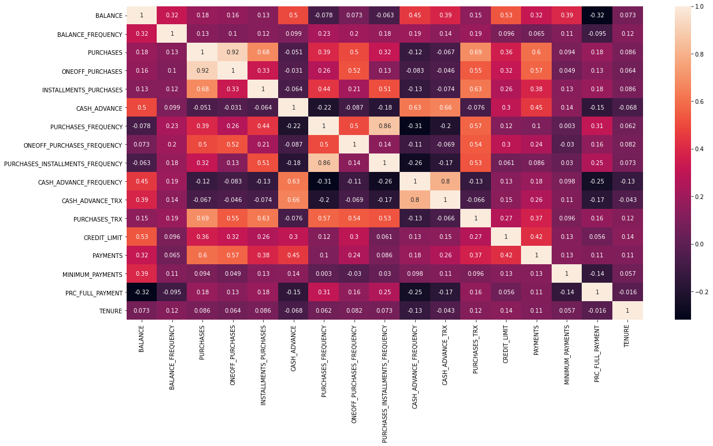
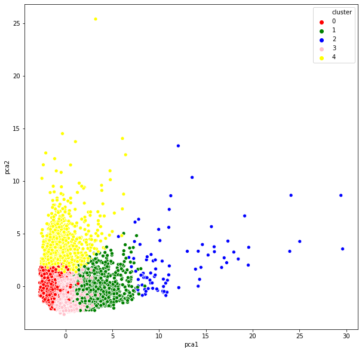

# Unsupervised Machine Learning for Customer Segmentation

Overview:
========
The project focuses on extracting insights related to bank customers.
The business objective is to divide the customers into segments that could be reached out to with different merketing campaigns.
The data represents the transactions frequency, amount...

The data is available in: https://www.kaggle.com/arjunbhasin2013/ccdata 

Project Objectives:
===========
* Understand how to leverage the power of machine learning to transform marketing departments and perform customer segmentation
* Apply Python libraries to import and visualize dataset images.
* Understand the theory and intuition behind k-means clustering machine learning algorithm
* Learn how to obtain the optimal number of clusters using the elbow method
* Apply Scikit-Learn library to find the optimal number of clusters using elbow method
* Apply k-means in Scikit-Learn to perform customer segmentation
* Understand the theory and intuition behind Principal Component Analysis (PCA) algorithm
* Apply Principal Component Analysis (PCA) technique to perform dimensionality reduction and data visualization
* Compile and fit unsupervised machine learning models such as PCA and K-Means to training data

Project Tasks
===========

    Task 1: Understand the problem statement and business case    
    Task 2: Import libraries and datasets    
    Task 3: Visualize and explore datasets    
    Task 4: Understand the theory and intuition behind k-means clustering machine learning algorithm    
    Task 5: Learn how to obtain the optimal number of clusters using the elbow method    
    Task 6: Use Scikit-Learn library to find the optimal number of clusters using elbow method    
    Task 7: Apply k-means using Scikit-Learn to perform customer segmentation    
    Task 8: Apply Principal Component Analysis (PCA) technique to perform dimensionality reduction and data visualization    

Exploratory Data Analysis:
Various steps were performed to clean the data, an example of the steps is the heatmap of the correlations between the different features:

Results:
The clustering obtained 5 clusters (could be optimized further). The below clusters represent different types of customers and their habits:

